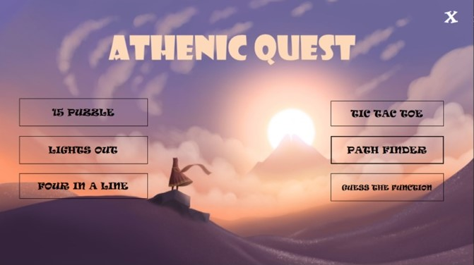
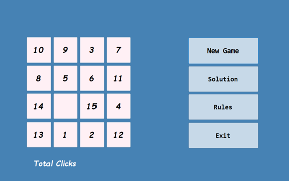
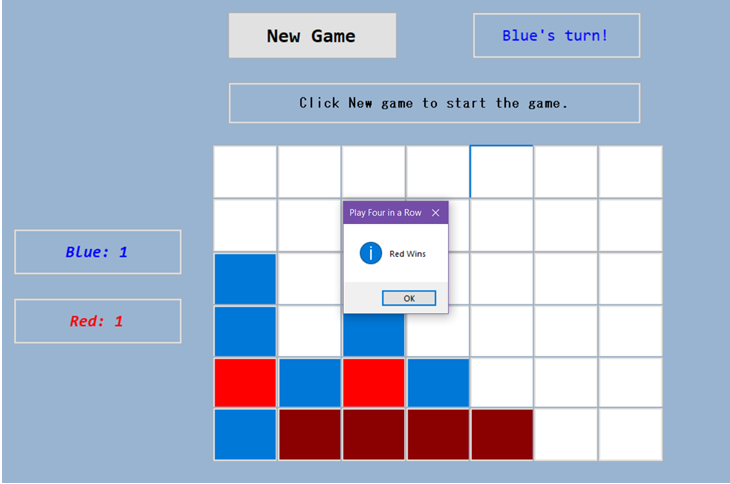
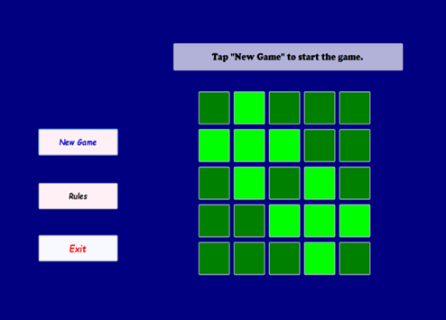
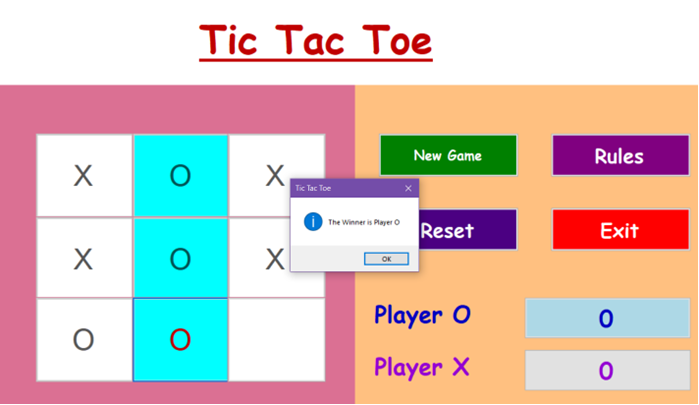
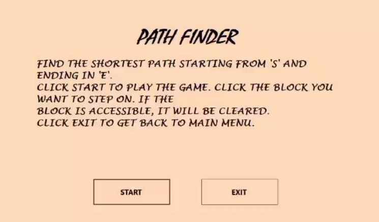
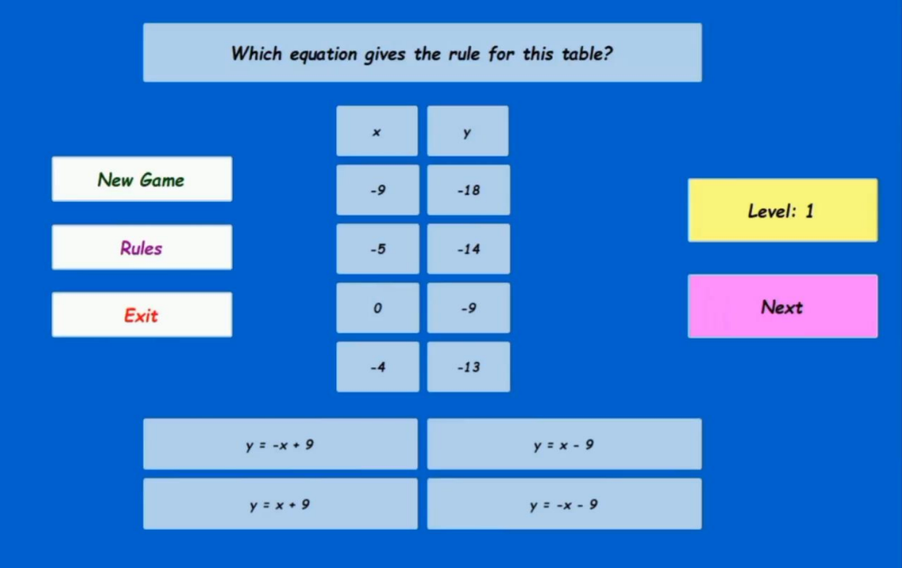

# Athenic-Quest

A  collection of brain games. You can [install](Setup_AthenicQuest/Release/Setup_AthenicQuest.msi) it in your windows pc.
 
## Goals and Details

To build a collection of logic-based puzzles that demands the application of logical thinking process and algorithmic reasoning and thus improves analytical intuition beneficial for budding programmers.

This project aims to motivate the players to use logical reasoning and analytical thinking process and make an intuitive foundation helpful for entering the spectrum of computational logistics in a fun, engaging way. However, anyone with a liking for problem solving can enjoy this collection of games and puzzles. To conclude, this is an enjoyable way to facilitate our pastimes. 

<h3><em>In this project, the logic-based puzzles and games presented before the user are classified into 3 categories.   
1. Algebraic Category  
2. Combinatorial Category  
3. Graph Theory-based Category</em>   

<strong>Main menu contains the individual 6 games. </strong></h3>

## Gameplay Instructions 1
## 15 Puzzle:
- Move tiles in grid to order them from 1 to 15. 
- To move a tile, you can click on it
- When you get them in order from 1 to 15 you win

## Four in a Line:
- ##15 Puzzle:
- Move tiles in grid to order them from 1 to 15. 
- To move a tile, you can click on it
- When you get them in order from 1 to 15 you win

## Lights Out:
- Lights Out is a puzzle game consisting of a grid of lights that are either on (light green) or off (dark green). 
- Pressing any light will toggle it and its adjacent lights. 
- The goal of the game is to switch all the lights off.

## Tic Tac Toe:
- The game is played on a 3 x 3 grid.
- Players take turns putting their marks in empty squares.
- The first player to get 3 of his marks in a row (up, down, across, or diagonally) is the winner.
- When all 9 squares are full, the game is over. 
- If no player has 3 marks in a row, the game ends in a tie. 

## Path Finder:
- Find the shortest path from ‘S’ to ‘E’.
- Click ‘Start’ to play the game. 
- Click the block you want to step on. If the block is accessible, it’ll be cleared.
- Once you find the shortest path, you can proceed to the next level by clicking ‘NEXT’.

## Guess the Function:
- Choose a function out of four functions which validates the values of x and y of the given table.
- If you get the correct answer, click ‘Next’ to proceed to the next level. Unless you get the correct answer, you can’t do the same.

## Platform:

<h3>Windows </h3>

## Tools Used
IDE Visual Studio Community 2019 
		<h4>Workload:<h4>
 - Desktop development with c++
 <h4>	Individual components:</h4>
 - Windows forms .NET Framework 4.6.1 targeting pack 
 - .NET Framework 4.8 SDK 
 - C++/CLI support for v142 build tools (14.26) 

